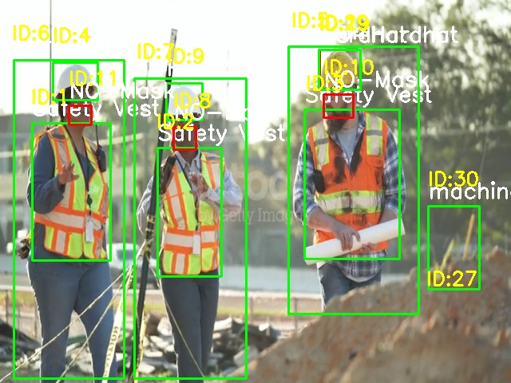
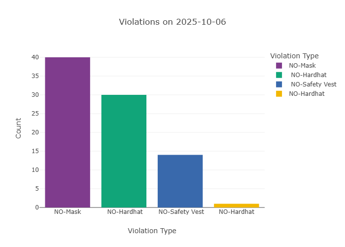
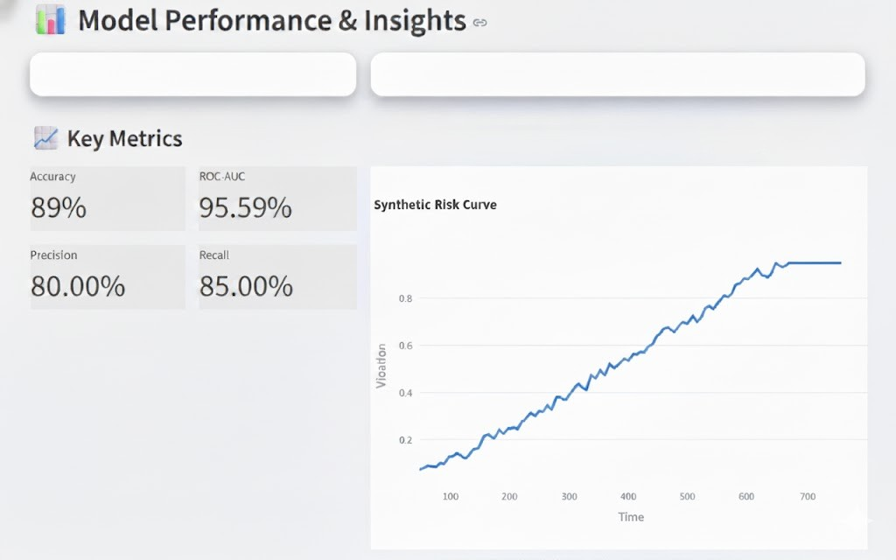

# SafetyEye – AI-Powered Workplace Occupancy & Safety Monitor

Milestone 1 (Week 1–2): **Data Preparation & Environment Setup**

This VS Code–ready repo scaffolds your project and includes runnable scripts to:
- Define safety rules and project architecture
- Download the **Construction Site Safety Image Dataset (Roboflow) from Kaggle**
- Prepare/verify YOLOv8-compatible data layout
- Split into train/val/test
- Validate environment & GPU
- (Optional) Kick off a YOLOv8 training sanity check

> Dataset link: Kaggle – Construction Site Safety Image Dataset (Roboflow)

## Quick Start

### 1) Clone/Download
Unzip this folder and open it in **VS Code**.

### 2) Create Environment
You can use **conda** or **venv**.

**Conda (recommended):**
```bash
conda env create -f environment.yml
conda activate safetyeye
```

**venv:**
```bash
python -m venv .venv
# Activate:
# Windows: .venv\Scripts\activate
# macOS/Linux: source .venv/bin/activate
pip install -r requirements.txt
```

### 3) Kaggle API setup (to auto-download the dataset)
- Create a Kaggle account → Account → *Create New API Token* to download `kaggle.json`.
- Place `kaggle.json` in one of:
  - Windows: `%USERPROFILE%\.kaggle\kaggle.json`
  - macOS/Linux: `~/.kaggle/kaggle.json`
  - Or this project root (script will copy it to the right place).
- Alternatively, set env vars in a `.env` file (see `.env.example`).

### 4) Prepare data
```bash
# 1) Download from Kaggle (automated). If you already downloaded manually, skip this.
python scripts/prepare_data.py --step download

# 2) Verify & arrange YOLOv8 structure
python scripts/prepare_data.py --step verify

# 3) Split into train/val/test (default 70/20/10)
python scripts/prepare_data.py --step split --train 0.7 --val 0.2 --test 0.1

# 4) Generate Ultralytics data.yaml pointing to splits
python scripts/prepare_data.py --step make-yaml
```

### 5) Check environment
```bash
python -m src.training.setup_env_check
```

### 6) (Optional) Run a tiny training sanity check
```bash
# Update configs/data.yaml paths if needed, then:
python -m src.training.train_yolov8 --model yolov8n.pt --epochs 5
```

## Repo Layout

```
SafetyEye/
├─ configs/
│  ├─ safety_rules.yaml        # Violation definitions
│  ├─ project.json             # Paths & project metadata
│  └─ data.yaml                # Ultralytics YOLOv8 dataset config (generated)
├─ data/
│  ├─ raw/                     # Raw Kaggle download
│  ├─ interim/                 # Any intermediate conversions
│  └─ yolov8/                  # Final YOLOv8 structure: images/ & labels/ with train/val/test
├─ notebooks/
│  └─ 01_explore_dataset.ipynb # (placeholder) Use to visually inspect samples
├─ scripts/
│  └─ prepare_data.py          # Orchestrates download→verify→split→yaml
├─ src/
│  ├─ data/
│  │  ├─ download_kaggle.py
│  │  ├─ verify_and_prepare.py
│  │  └─ split_dataset.py
│  ├─ training/
│  │  ├─ setup_env_check.py
│  │  └─ train_yolov8.py
│  └─ utils/
│     └─ logger.py
├─ .env.example
├─ .gitignore
├─ environment.yml
└─ requirements.txt
```


In later milestones, use these rules to generate alerts & dashboard stats.

<p align="center">

  <!-- Violation Image -->
  
  
  <!-- Daily Chart Image -->
  

  <!-- Metrics Image -->
  

</p>


---

**Authoring tip:** Start with `yolov8n.pt` (smallest) to iterate quickly.
